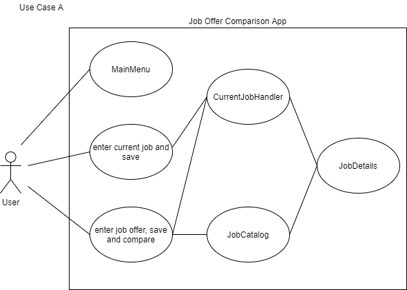
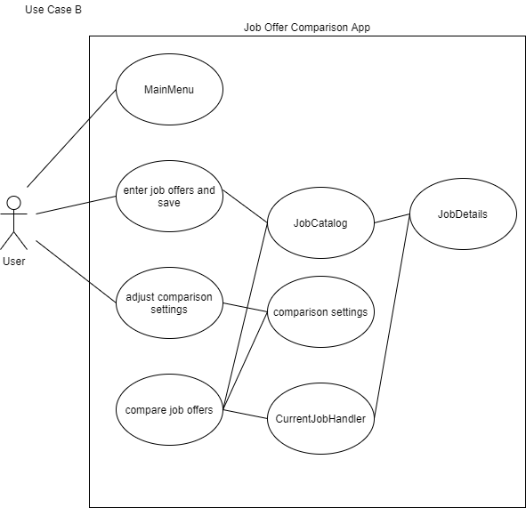
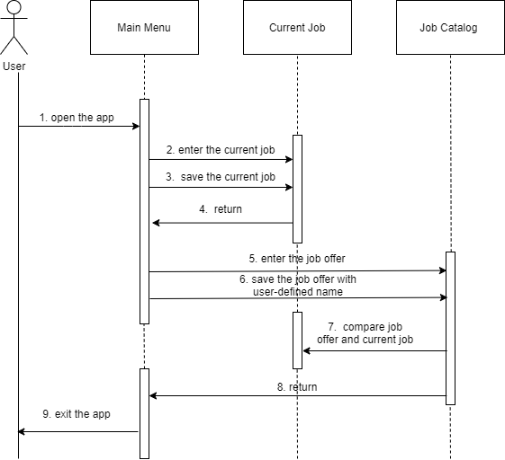
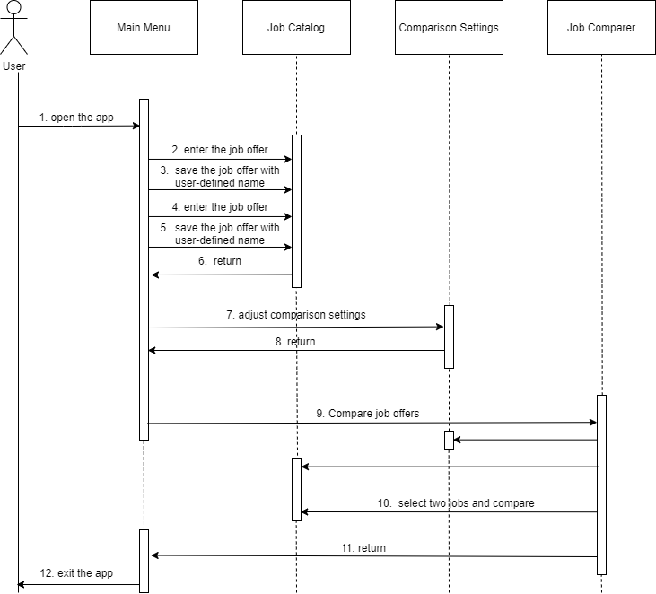

# Use Case Model

**Author**: \<Tianxiang Xu, txu308@gatech.edu\>

## 1 Use Case Diagram
### Use Case A
Requirements: This use case allows the user to compare current job and a job offer.\

### Use Case B:
Requirements: This use case allows the user to add several job offers and show the job list rankings with user-defined comparison setting. User will also free to compare any two of the jobs in the job list. \

## 2 Use Case Descriptions

### Use Case A:
#### Pre-conditions: 
N/A
#### Post-conditions: 
User will be shown a comparison between current job and an input job offer. And the current job and the job offer are saved in the system for future use. 
#### Scenarios:
1. User opens the app, and main menu is presented.
2. User selects to enter the current job and input the details.
3. User saves the current job input.
4. User returns to the main menu.
5. User selects to enter the job offer and input the details.
6. User saves the job offer with a user-defined name.
7. User selects to compare the offer with the current job. 
8. User selects to return to the main menu.
9. User exits the app. \

### Use Case B:
#### Pre-condition: 
User’s current job is saved.
#### Post-condition: 
User will get a job list ranking including current job and all the saved job offers. 
#### Scenarios:
1. User opens the app, and main menu is presented.
2. User selects to enter the job offers and input the details. 
3. User saves the job offer with a user-defined name.
4. User selects to enter another job offer.
5. User saves the job offer with a user-defined name.
6. User selects to return to the main menu.
7. User selects to adjust the comparison settings.
8. User returns to the main menu.
9. User selects to compare job offers. 
10. User selects Job offer A and Job offer B to compare the details.
11. User selects to return to the main menu
12. User exits the app.\

